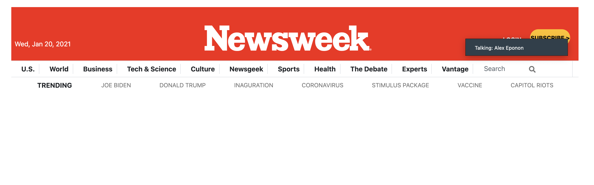
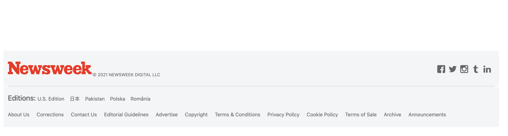

# Project-3-Newsweek

# Project Name: Newsweek-Website - Clone
## Week 3 Collaborative Project
This project brings us to learn and undestand the different CSS framework.
>Skills Revived & Learned:
- Versioning & best coding practices, Github Flow.
- HTML5, CSS3 elements, semantics, features etc.
- Cloning - the hard work and skills needed to successfully make a clone.
- Linter - install & fix errors
- Collaborative learning, being patient, helping each other succeed.
- Attending Daily standup, being focused, accountable.
> Learning Goals:
- Version Control, Github Flow
- Introduction to HTML5, CSS3, Bootstrap.
- Position, Flex, Grid, Floats, RWD

>## Built With
- Major languages: HTML5, CSS3
- Frameworks: Bootstrap, Github flow, Mobile First Approach
- Technologies used: Responsive Web Design
>## Live Demo
[Live Demo Link](https://smy5152.github.io/newsweek-clone-wk3/)
>## Getting started
- npm install bootstrap
### Prerequisites
- Create an account on github
- Install gitbash or use git on the command line.
- Use an IDE of your preference such as VScode.
- Linter tests
### Steps to follow
- Clone the repository to your locaL machine.
- Open the index.html file with the browser of your preference.
>## Authors
 👤 **Alex E**
- GitHub: [@Anvi98](https://github.com/Anvi98)
- Twitter: [@anvi_al](https://twitter.com/anvi_al)
- LinkedIn: [LinkedIn](https://www.linkedin.com/in/anvi-alex-eponon/)

 👤 **Eri-Ngozi Okereafor**
- GitHub: [@errea](https://github.com/errea)
- Twitter: [@Erreakay](https://twitter.com/Erreakay)
- LinkedIn: [eri-ngozi-okereafor](https://www.linkedin.com/in/eri-ngozi-okereafor/)
>## Show your support
  Give a :étoile:️ if you like this project!
>## Acknowledgments
- Hat tip to anyone whose code was used
- Inspiration
- Learning
>## :note: License
This project is [MIT](./LICENSE) licensed.